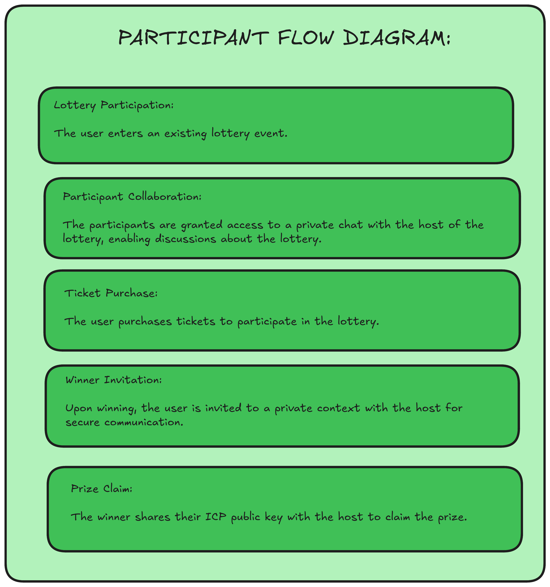
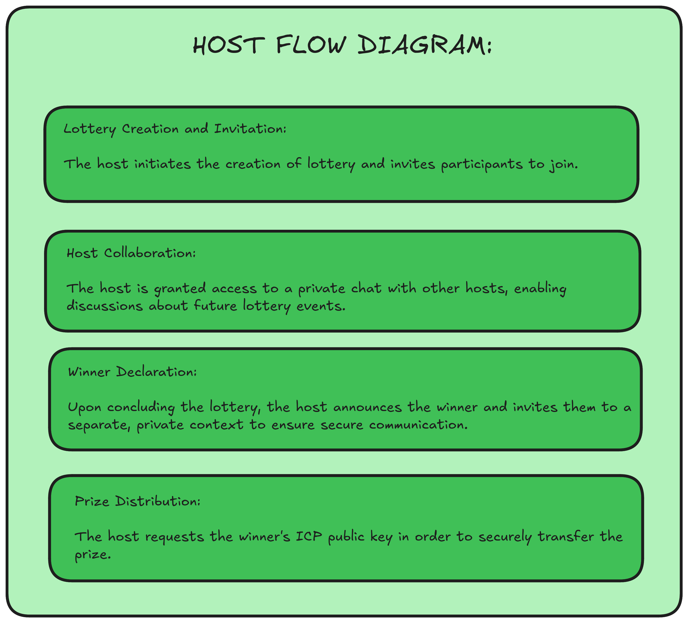

#  **LimeDraw**

*LimeDraw* is a revolutionary decentralized anonymous lottery app. It prioritizes privacy, transparency, and fairness using Calimero for anonymity and Internet Computer (ICP) for auditable randomness. This eliminates centralized control, creating a trustful, secure, and verifiable lottery system. Users participate anonymously, ensuring fair winner selection and encrypted prize pools.

## **Overview**
This repository contains:
- **ICP Smart Contracts** – Manages lotteries and their state on the Internet Computer blockchain.  
- **Calimero Private Context** – Provides private and secure contexts for individual lotteries.  
- **Front-End Application** – Offers a user-friendly interface for interacting with the lottery system.  
<!-- - ** -->

## **Getting Started**

### **Clone the Repository**
```bash title="Terminal"
git clone https://github.com/iamaa0205/LimeDraw.git
cd LimeDraw
```

### **Install dependencies**
```bash title="Terminal"
chmod +x install_dependencies.sh
./install_dependencies.sh
```
### **Setting up Calimero Node and ICP contracts**
Run the given script which will set up local ICP network and deploy the canisters. It also makes a host and deploys the application with the host
```bash title="Terminal"
cd logic
chmod +x ./script.sh
./script.sh
```

### **Add participants to the context**
Run the script which adds participants to the context. It takes number of participants you want to add as the argument.
```bash title="Terminal"
chmod +x ./participants.sh
./participants.sh <no-of-partipants>
```

All the data corresponding to the canisters, pub-pvt key pairs of the nodes and application id get stored to `./demo-blockchain-integrations/logic/node_vars.env` .


### **Run the backend**
Run the backend node.js server for encryption and decryption of calimero public keys.
```bash title="Terminal"
cd rsa-encryption-app
node server.js
```
## **Features**
- Encrypted Prize Pools
- Ensuring Winner Anonymity And Secure Ticket Mapping
- Private Chat Rooms for Hosts
- Auditable Random Number Generation For Winner Selection

## **Architecture of LimeDraw**


## **Participant Flow diagram**


## **Admin Flow diagram**


## **Video Demo**
The video demo of the project can be found [here](https://youtu.be/ISxYTMBmgrc).

## **Team members**
This project is made with ❤️ by 
- Aaditya Aren
- Dhruv Goyal
- Mradul Singhal
